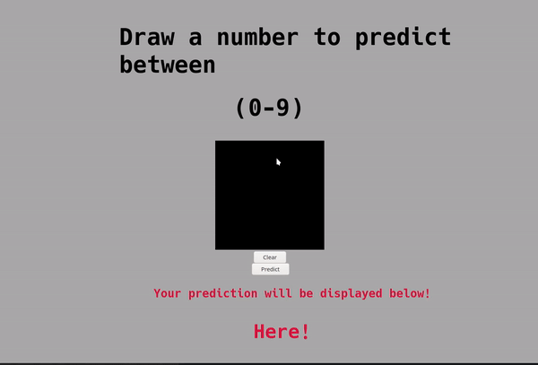

# Emerging Technologies
We were asked to develop a single paged web application that allows the user to hand draw and identify numbers from zero to nine. This involved using a MNIST dataset to train a neural network in identifying and correctly predicting hand wrtten digits.
The web application was contstructed using HTML, Javascript and CSS.
The model was constructed in the Jupyter Notebook using Keras and these are linked using the Flask which send data back and forth between the notebook and web app.

## Setup
* Clone the repository `https://github.com/niemaattarian/EmergingTechnologies.git`
* cd `into directory`
* `pip install -r requirements.txt`

### Note:
These are the following versions I am using:
* Python version 3.7.5
* Keras version 2.3.1
* Tensorflow version 2.0.1

## Running the project
The first step to running the project is running the flask - `web.py` 

Once ran, open a browser to and navigate to ` http://127.0.0.1:5000/`

### Here is an example of what it should look like

## Research
In starting this project, I had to do some research on many things including Keras, Tensorflow, Neural Networks and the MNIST datasets.

I came across various examples of a working MNIST dataset which I have adapted to suit my model. These included a [video](https://www.youtube.com/watch?v=wQ8BIBpya2k) breaking down the model and a working [mnist dataset](https://www.ics.uci.edu/~mohamadt/keras_mnist.html). I also came across this example of [graphing MNIST](https://colah.github.io/posts/2014-10-Visualizing-MNIST/) data points visually in 2D and 3D for a slightly better understanding.

Continuing my research and what I found particularly useful was the [Keras Documentation](https://keras.io/getting-started/faq/#how-can-i-save-a-keras-model) page. They gave substantial breakdown on a lot of things explaining them in-depth. A good example of this was their breakdown of [Layers](https://keras.io/layers/about-keras-layers/) in the model. It is from here where I gained most of my understanding of the 'Dense' which I used in my model extensively.

Furthermore, I found the videos on learnonline very useful. I used the methods in these vidoes and adapted them to fit my project. This is evident in my method of saving the canvas image and resizing it appropriately. This was adapted from [this video](https://web.microsoftstream.com/video/d792fd34-356d-4b7c-80f8-936c5d2877e1?referrer=https:%2F%2Flearnonline.gmit.ie%2Fcourse%2Fview.php%3Fid%3D135) that was on learnonline.

I also came across a very simple way of [drawing to the canvas](https://www.codicode.com/art/how_to_draw_on_a_html5_canvas_with_a_mouse.aspx). This was beneficial and matched with this [link](https://stackoverflow.com/questions/13198131/how-to-save-an-html5-canvas-as-an-image-on-a-server/13198699#13198699) from learnonline helped improve the accuracy of my prediction. This was due to the canvas being black and the hand-drawing being white. I did this as I seen most of the training data to be a white drawing on a black canvas.

The Tensorflow page, like the Keras page, helped a lot in my research. They break down the model very simply, especially when it came to the [saving and loading](https://www.tensorflow.org/tutorials/keras/save_and_load) of the model. This is what formed the predictions of the image taken in.

The Flask page was very useful I didn't know much regarding Flask before this project. It helped me understand the link between the Web Application and the Model and how it formed the bridge between them.

## Conslusion
In conclusion, I found that there was extensive information and documentation readily available which was very useful when it came to the understanding of Tensorflow, Keras, Flask and how Neural Networks work. There is also a lot of content regarding improving your neural network and making it more pleasing for the user.

## References
I included many references within my code for convenience. I also included references within my research as clickable links highlighted in blue.
https://docs.python.org/3/library/base64.html
https://towardsdatascience.com/image-classification-in-10-minutes-with-mnist-dataset-54c35b77a38d
https://stackoverflow.com/questions/13198131/how-to-save-an-html5-canvas-as-an-image-on-a-server/13198699#13198699
https://codereview.stackexchange.com/questions/132914/crop-black-border-of-image-using-numpy
https://keras.io/examples/mnist_cnn/
